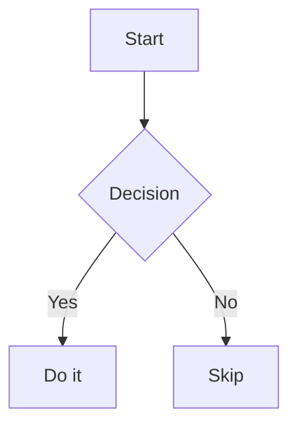

# Webchat UI Enhancements Implementation Plan

> **For agentic workers:** REQUIRED SUB-SKILL: Use superpowers:subagent-driven-development (recommended) or superpowers:executing-plans to implement this plan task-by-task. Steps use checkbox (`- [ ]`) syntax for tracking.

**Goal:** Add copy buttons, scrollable code blocks, Mermaid diagram rendering, and a hover message-actions toolbar to the Jarvis webchat UI.

**Architecture:** All changes are confined to three files: `MarkdownRenderer.jsx` gets a `CodeBlock` component (copy + scroll) and `MermaidBlock` component; `ChatTranscript.jsx` gets a `MessageWithActions` wrapper that renders the hover toolbar; `global.css` gets the supporting CSS. No backend changes.

**Tech Stack:** React 18, lucide-react (already installed), mermaid npm package (to install), react-syntax-highlighter (already installed).

---

## File Map

| File | What changes |
|---|---|
| `apps/ui/package.json` | Add `mermaid` dependency |
| `apps/ui/src/components/chat/MarkdownRenderer.jsx` | Add `CodeBlock` + `MermaidBlock` components; wire into `pre` override |
| `apps/ui/src/components/chat/ChatTranscript.jsx` | Add `MessageWithActions` component; use it for assistant messages |
| `apps/ui/src/styles/global.css` | Add `.code-copy-btn`, `.message-group`, `.message-actions`, `.mermaid-block` CSS |

There are no existing frontend unit tests. Verification is done by running the dev server and inspecting in the browser.

---

### Task 1: Install mermaid package

**Files:**
- Modify: `apps/ui/package.json`

- [ ] **Step 1: Install mermaid**

```bash
cd apps/ui && npm install mermaid
```

- [ ] **Step 2: Verify it landed in package.json**

```bash
grep '"mermaid"' apps/ui/package.json
```

Expected: `"mermaid": "^<version>"`

- [ ] **Step 3: Commit**

```bash
git add apps/ui/package.json apps/ui/package-lock.json
git commit -m "chore: install mermaid for diagram rendering in webchat"
```

---

### Task 2: Refactor MarkdownRenderer — CodeBlock + MermaidBlock + scroll

**Files:**
- Modify: `apps/ui/src/components/chat/MarkdownRenderer.jsx`

Current file is 68 lines. Replace it entirely with the version below, which adds:
- `MermaidBlock` — renders `mermaid` fenced blocks as SVG
- `CodeBlock` — wraps SyntaxHighlighter with copy button and 300px max-height scroll
- `pre` override dispatches to the right component based on language

- [ ] **Step 1: Replace MarkdownRenderer.jsx**

Write the following as the complete file content of `apps/ui/src/components/chat/MarkdownRenderer.jsx`:

```jsx
import { useState, useEffect, useRef } from 'react'
import Markdown from 'react-markdown'
import remarkGfm from 'remark-gfm'
import { Prism as SyntaxHighlighter } from 'react-syntax-highlighter'
import { oneDark } from 'react-syntax-highlighter/dist/esm/styles/prism'
import { Copy, Check } from 'lucide-react'
import mermaid from 'mermaid'

mermaid.initialize({ startOnLoad: false, theme: 'dark' })

/**
 * Renders a mermaid fenced block as an inline SVG diagram.
 * Falls back to raw code text on render errors.
 */
function MermaidBlock({ code }) {
  const ref = useRef(null)

  useEffect(() => {
    if (!ref.current) return
    const id = `mermaid-${Math.random().toString(36).slice(2)}`
    mermaid
      .render(id, code)
      .then(({ svg }) => {
        if (ref.current) ref.current.innerHTML = svg
      })
      .catch(() => {
        if (ref.current) ref.current.textContent = code
      })
  }, [code])

  return <div ref={ref} className="mermaid-block" />
}

/**
 * Renders a syntax-highlighted code block with a floating copy button
 * and a 300px max-height with scroll for long blocks.
 */
function CodeBlock({ language, code }) {
  const [copied, setCopied] = useState(false)

  function handleCopy() {
    navigator.clipboard.writeText(code).then(() => {
      setCopied(true)
      setTimeout(() => setCopied(false), 1500)
    })
  }

  return (
    <div style={{ position: 'relative' }}>
      <button onClick={handleCopy} className="code-copy-btn" title="Kopiér kode">
        {copied ? <Check size={13} /> : <Copy size={13} />}
      </button>
      <SyntaxHighlighter
        style={oneDark}
        language={language || 'text'}
        PreTag="div"
        customStyle={{
          margin: '0.5em 0',
          borderRadius: '6px',
          fontSize: '0.85em',
          maxHeight: '300px',
          overflowY: 'auto',
        }}
      >
        {code}
      </SyntaxHighlighter>
    </div>
  )
}

/**
 * Renders markdown content in chat bubbles.
 * Supports paragraphs, bold, italic, lists, links, tables (remark-gfm),
 * inline code, fenced code blocks with syntax highlighting,
 * copy button, 300px scroll cap, and mermaid diagram rendering.
 */
export function MarkdownRenderer({ content }) {
  if (!content) return null

  return (
    <Markdown
      remarkPlugins={[remarkGfm]}
      components={{
        // Block-level code: <pre><code class="language-x">…</code></pre>
        pre({ children }) {
          const codeChild = children?.props
          if (!codeChild) return <pre>{children}</pre>

          const className = codeChild.className || ''
          const match = /language-(\w+)/.exec(className)
          const language = match ? match[1] : 'text'
          const codeText = String(codeChild.children || '').replace(/\n$/, '')

          if (language === 'mermaid') {
            return <MermaidBlock code={codeText} />
          }

          return <CodeBlock language={language} code={codeText} />
        },
        // Inline code: `backtick`
        code({ children, ...props }) {
          return (
            <code className="inline-code" {...props}>
              {children}
            </code>
          )
        },
        // Open links in new tab
        a({ children, ...props }) {
          return (
            <a target="_blank" rel="noopener noreferrer" {...props}>
              {children}
            </a>
          )
        },
      }}
    >
      {content}
    </Markdown>
  )
}
```

- [ ] **Step 2: Verify syntax compiles**

```bash
cd apps/ui && npm run build 2>&1 | tail -20
```

Expected: Build succeeds (exit 0). If mermaid tree-shaking causes issues, they appear here.

- [ ] **Step 3: Commit**

```bash
git add apps/ui/src/components/chat/MarkdownRenderer.jsx
git commit -m "feat: code block copy button, scroll cap, and mermaid rendering"
```

---

### Task 3: Add CSS for code copy button and mermaid block

**Files:**
- Modify: `apps/ui/src/styles/global.css`

Append the following CSS at the end of the file (after line 319, after the last `.approval-status` rule):

- [ ] **Step 1: Append CSS to global.css**

Add to the end of `apps/ui/src/styles/global.css`:

```css
/* Code block copy button */
.code-copy-btn {
  position: absolute; top: 8px; right: 8px; z-index: 1;
  background: rgba(255,255,255,0.08); border: none; border-radius: 6px;
  color: #aaa; padding: 5px; cursor: pointer;
  display: flex; align-items: center;
  transition: background 0.15s, color 0.15s;
}
.code-copy-btn:hover { background: rgba(255,255,255,0.15); color: #e0e0e0; }

/* Mermaid diagrams */
.mermaid-block {
  overflow: auto; background: #1e1e1e; border-radius: 6px;
  padding: 16px; margin: 0.5em 0;
}
.mermaid-block svg { max-width: 100%; height: auto; }
```

- [ ] **Step 2: Commit**

```bash
git add apps/ui/src/styles/global.css
git commit -m "feat: CSS for code block copy button and mermaid diagrams"
```

---

### Task 4: Add message actions toolbar to ChatTranscript

**Files:**
- Modify: `apps/ui/src/components/chat/ChatTranscript.jsx`

Extract the assistant message rendering into a `MessageWithActions` component that shows a hover toolbar (Copy + ThumbsUp) beneath the bubble when not pending.

- [ ] **Step 1: Replace ChatTranscript.jsx**

Write the following as the complete file content of `apps/ui/src/components/chat/ChatTranscript.jsx`:

```jsx
import { useState, useEffect, useRef } from 'react'
import { Copy, Check, ThumbsUp } from 'lucide-react'
import { MarkdownRenderer } from './MarkdownRenderer'
import { ApprovalCard } from './ApprovalCard'

/**
 * Renders a single assistant message bubble with a hover toolbar.
 * Toolbar shows: Copy message | Thumbs up
 * Only rendered for non-pending assistant messages.
 */
function MessageWithActions({ message, workingSteps }) {
  const [copied, setCopied] = useState(false)
  const [liked, setLiked] = useState(false)

  function handleCopy() {
    navigator.clipboard.writeText(message.content || '').then(() => {
      setCopied(true)
      setTimeout(() => setCopied(false), 1500)
    })
  }

  return (
    <div className="message-group">
      <div className={`message-bubble ${message.pending ? 'pending' : ''}`}>
        {message.pending && workingSteps?.length > 0 ? (
          <span className="working-shimmer">
            {workingSteps.find((s) => s.status === 'running')?.detail ||
              workingSteps.find((s) => s.status === 'running')?.action ||
              'working…'}
          </span>
        ) : null}
        {message.content ? (
          <div className="message-content">
            <MarkdownRenderer content={message.content} />
            {message.pending && <span className="streaming-cursor" />}
          </div>
        ) : null}
      </div>
      {!message.pending && (
        <div className="message-actions">
          <button onClick={handleCopy} title="Kopiér besked">
            {copied ? <Check size={12} /> : <Copy size={12} />}
          </button>
          <button
            onClick={() => setLiked((l) => !l)}
            title="Synes godt om"
            className={liked ? 'liked' : ''}
          >
            <ThumbsUp size={12} />
          </button>
        </div>
      )}
    </div>
  )
}

export function ChatTranscript({ messages, workingSteps }) {
  const transcriptRef = useRef(null)

  useEffect(() => {
    const node = transcriptRef.current
    if (!node) return
    node.scrollTop = node.scrollHeight
  }, [messages])

  if (!messages.length) {
    return (
      <section ref={transcriptRef} className="transcript empty-transcript">
        <div className="empty-transcript-copy">
          <p className="eyebrow">Front Door</p>
          <strong>Start a conversation</strong>
          <p className="muted">This session is persisted and will still be here after refresh.</p>
        </div>
      </section>
    )
  }

  return (
    <section ref={transcriptRef} className="transcript">
      {messages.filter((m) => m.role !== 'tool').map((message) =>
        message.role === 'approval_request' ? (
          <article key={message.id} className="message-row assistant">
            <div className="message-bubble">
              <ApprovalCard approval={message} />
            </div>
          </article>
        ) : (
          <article key={message.id} className={`message-row ${message.role}`}>
            <div className="message-name">
              {message.role === 'assistant' ? 'Jarvis' : 'Du'}
            </div>
            {message.role === 'assistant' ? (
              <MessageWithActions message={message} workingSteps={workingSteps} />
            ) : (
              <div className={`message-bubble ${message.pending ? 'pending' : ''}`}>
                {message.content ? (
                  <div className="message-content">
                    <MarkdownRenderer content={message.content} />
                  </div>
                ) : null}
              </div>
            )}
            <div className="message-time">{message.ts}</div>
          </article>
        )
      )}
    </section>
  )
}
```

- [ ] **Step 2: Verify syntax compiles**

```bash
cd apps/ui && npm run build 2>&1 | tail -20
```

Expected: Build succeeds (exit 0).

- [ ] **Step 3: Commit**

```bash
git add apps/ui/src/components/chat/ChatTranscript.jsx
git commit -m "feat: message actions toolbar (copy + thumbs up) on assistant messages"
```

---

### Task 5: Add CSS for message actions toolbar

**Files:**
- Modify: `apps/ui/src/styles/global.css`

Append the message-group and message-actions CSS after the mermaid block CSS added in Task 3.

- [ ] **Step 1: Append CSS to global.css**

Add to the end of `apps/ui/src/styles/global.css`:

```css
/* Message actions hover toolbar */
.message-group { display: flex; flex-direction: column; }
.message-actions {
  display: flex; gap: 6px; padding: 2px 4px;
  opacity: 0; transition: opacity 0.15s;
}
.message-group:hover .message-actions { opacity: 1; }
.message-actions button {
  background: none; border: none; color: #666;
  cursor: pointer; padding: 3px 6px; border-radius: 4px;
  display: flex; align-items: center; gap: 3px; font-size: 11px;
}
.message-actions button:hover { color: #aaa; background: rgba(255,255,255,0.05); }
.message-actions button.liked { color: #6b9fff; }
```

- [ ] **Step 2: Commit**

```bash
git add apps/ui/src/styles/global.css
git commit -m "feat: CSS for message actions hover toolbar"
```

---

### Task 6: Visual verification

Start the dev server and manually verify all features work.

- [ ] **Step 1: Start dev server**

```bash
cd apps/ui && npm run dev
```

Open the UI in the browser (default: http://localhost:5173).

- [ ] **Step 2: Verify copy button on code blocks**

Send a message that returns a fenced code block. Confirm:
- Copy icon appears top-right corner of the block
- Clicking it switches to a checkmark for ~1.5 s
- Pasted content matches the code

- [ ] **Step 3: Verify scroll on long code blocks**

Send a message with a code block longer than ~20 lines. Confirm:
- Block is capped at 300px height
- Scrollbar appears and scrolls the code
- Copy button is still visible at the top

- [ ] **Step 4: Verify Mermaid rendering**

Send a message containing:

````

````

Confirm: Diagram renders as SVG, not as syntax-highlighted text.

- [ ] **Step 5: Verify message actions toolbar**

Hover over an assistant message bubble. Confirm:
- Copy icon + ThumbsUp icon appear below the bubble
- Clicking Copy switches to checkmark for ~1.5 s
- Clicking ThumbsUp turns it blue (toggled)
- Toolbar is not visible on user messages

- [ ] **Step 6: Verify streaming cursor still works**

Send a message and watch Jarvis respond. Confirm:
- Blinking cursor appears at the end of streaming text
- Working shimmer shows during tool calls
- No regression on existing behavior
