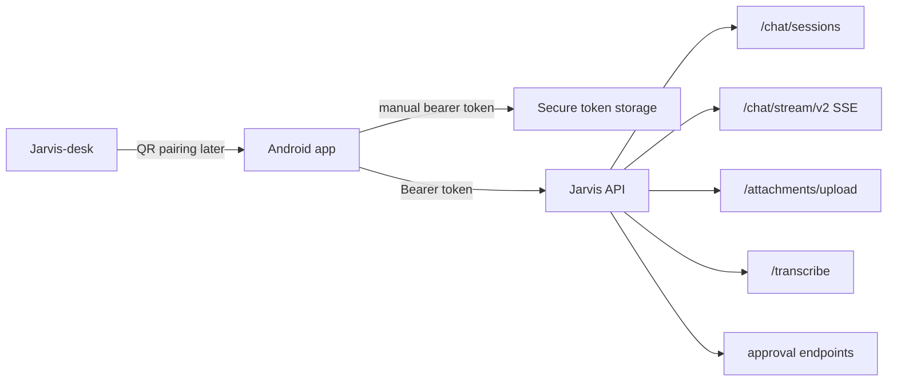

# Jarvis Mobile Companion V1 Design

Date: 2026-06-17

## Purpose

Jarvis Mobile Companion is the Android-first mobile app for talking to Jarvis through the public Jarvis API at `https://api.srvlab.dk/`.

The app should feel as simple as ChatGPT, Claude, or DeepSeek on mobile: open the app, write or speak, get a streamed answer, continue the conversation, and handle attachments without thinking about the system behind it. Jarvis-specific power should be present, but not noisy. Mission Control stays primarily desktop-first; mobile starts as a reliable chat companion with approvals and status.

## Product Position

Jarvis-desk remains the rich desktop/admin surface. Jarvis Mobile is a direct HTTPS client for the Jarvis API, not a LAN client and not a bridge through the desktop app.

Jarvis-desk still has an important role:

- show QR pairing for fast mobile setup
- manage devices later
- expose admin/security controls later
- remain the place for code, workspace, and Mission Control-heavy workflows

The mobile app owns:

- fast chat access
- voice input
- image/file attachment
- approval decisions
- push notifications
- mobile-safe status

## Confirmed Constraints

- Default API base URL: `https://api.srvlab.dk/`
- Auth V1: manual token login, matching Jarvis-desk's current setup flow
- Email/password login: planned next auth layer when the backend path is verified stable for mobile
- QR pairing: included for faster setup, backed by a future or existing token issuance flow
- Google login: explicitly later, not V1 blocking scope
- App target: Android first
- UX target: simple, user-friendly, failure-safe AI chat app
- Visual target: Jarvis-desk theme and identity, not a ChatGPT/Claude brand clone

## Recommended Stack

Use React Native with Expo for V1.

Reasons:

- Jarvis-desk is already React/TypeScript.
- Existing API types, stream reducer ideas, message block rendering, and design tokens can be reused or mirrored.
- V1 needs product speed and cross-platform optionality more than native-only Android optimization.
- Expo gives a practical route for Android builds, push notifications, secure storage, image picker, camera QR scanning, and over-the-air iteration.

Native Kotlin + Jetpack Compose remains a valid later rewrite or power-user branch if Android platform depth becomes more important than sharing code with desk.

## Existing Backend Fit

The public API already exposes the V1 foundation:

- `GET /health`
- bearer-token authenticated requests matching Jarvis-desk's current auth model
- `POST /api/auth/login` later, when email/password auth is verified stable for mobile
- `GET /api/whoami`
- `GET/POST /chat/sessions`
- `GET /chat/sessions/{session_id}`
- `POST /chat/stream/v2`
- `POST /attachments/upload`
- `POST /transcribe`
- `POST /chat/approvals/{approval_id}/approve`
- `POST /chat/approvals/{approval_id}/deny`
- `POST /chat/runs/{run_id}/cancel`
- `POST /chat/runs/{run_id}/steer`
- `GET /chat/visible-providers`

The Android client should treat `/chat/stream/v2` as the primary streaming contract. It should not invent a mobile-only chat protocol unless a concrete mobile failure appears.

## V1 Screens

### Login

The first screen offers two paths:

- manual token login
- scan QR from Jarvis-desk

Manual token login matches the current Jarvis-desk setup model: the user enters the public API URL and a bearer token. The default API URL is prefilled as `https://api.srvlab.dk/`. Advanced settings may expose the API URL for dev/self-hosted use.

Login stores tokens in Android secure storage, not AsyncStorage/plain storage. Email/password login is a later auth option once the server flow is ready for mobile.

### Chat

The app opens into chat, not a dashboard.

Header:

- compact Jarvis presence ring
- current connection state
- new chat button
- history/menu button

Main area:

- chronological messages
- assistant streaming state
- rich blocks for markdown, code, images, tool/approval cards
- visible interrupted/hung state when streaming breaks

Composer:

- multiline text field
- send/stop button
- microphone button
- attachment button
- optional compact mode/model control in a bottom sheet

The composer must keep drafts through network errors, token refresh, app backgrounding, and failed sends.

### History

Conversation history opens as a drawer or full-screen sheet. It supports:

- recent sessions
- search
- rename
- delete with confirmation
- new chat

History should never block the first chat screen from loading. If history fails, the user can still start a new chat if authenticated.

### Approval Card

Approvals are mobile-first safety UI:

- tool/action name
- concise reason
- risk level if backend provides it
- allow button
- deny button
- optional details expansion

Mobile must never silently auto-approve risky actions. Owner power on a public API must stay explicit.

### Settings

V1 settings stay small:

- account identity
- API endpoint
- sign out
- default model/thinking mode
- app theme
- diagnostics: API reachable, token valid, app version

Google login, device management, advanced Mission Control, and plugin settings are later work.

## Design Language

The app should borrow successful mobile AI UX patterns, not brand identity:

- direct chat first
- minimal chrome
- hidden complexity
- predictable bottom composer
- small icon controls
- clear retry/stop/continue actions
- obvious failure states

Jarvis visual identity:

- dark base matching Jarvis-desk
- restrained contrast
- Jarvis presence ring as the primary brand signal
- no decorative clutter
- no heavy dashboard cards in the first viewport
- readable long-form output
- native mobile spacing and touch targets

## Failure-Safe Requirements

The app must be designed around failure, because mobile networking is unstable.

Required behavior:

- Do not duplicate user messages on reconnect.
- Preserve partial assistant output when a stream breaks.
- Show "continue" or "retry" explicitly instead of silent blind reposting.
- Keep unsent text as a draft.
- Refresh auth without losing the current screen when possible.
- If auth refresh fails, send the user to login with current draft preserved locally.
- Show offline state immediately.
- Treat HTTP 401/403 as an auth problem, not a generic failure.
- Treat HTTP 429 as rate limiting with a wait/retry message.
- Treat server 5xx as transient unless repeated.
- Cancel active run server-side when the user taps stop and a run id exists.

## Security Model

V1 starts with manual token login. Tokens should be handled as production credentials:

- access token stored in secure storage
- refresh token stored in secure storage if refresh is available
- no token in URLs
- no token in logs
- API base URL must be HTTPS by default
- destructive actions require explicit user confirmation
- approvals are rendered from backend events, not inferred by text parsing

QR pairing should avoid long-lived raw owner tokens in QR codes. Preferred model:

- Jarvis-desk requests a short-lived pairing code
- Android scans QR with API URL and pairing code
- Android exchanges code for its own device-bound token
- backend records device name, app id, role, and expiry

If this exchange endpoint is not present when implementation starts, V1 ships manual token login first and hides QR pairing behind a disabled feature flag until the backend supports it safely.

## Push Notifications

Push is not required for the first chat loop, but it is central to the mobile companion value.

Recommended V1.1:

- Android obtains FCM token
- app registers token with Jarvis API
- backend stores token per user/device
- Jarvis sends notifications for approval requests, completed long runs, and direct attention events

Notification actions later:

- approve
- deny
- open run
- reply

Approval from notification should require device unlock and should not bypass backend policy.

## Data Flow

## Implementation Phases

### Phase 1: Chat MVP

- Expo app scaffold
- secure auth storage
- manual token login
- session list
- create/select chat
- `/chat/stream/v2` streaming
- markdown text rendering
- stop/cancel
- reconnect/error states

### Phase 2: Rich Companion

- image/file attachments
- voice dictation through `/transcribe`
- code block rendering and copy
- message actions
- model/thinking controls
- search history

### Phase 3: Safety and Approvals

- approval cards
- deny/approve actions
- run status indicators
- stronger destructive-action confirmations
- token refresh polish

### Phase 4: QR and Device Trust

- QR scanner
- short-lived pairing exchange
- device registry
- revoke device from desk/admin
- device-bound token claims where supported

### Phase 5: Push

- FCM registration
- backend device push registry
- approval notifications
- completed-run notifications
- notification deep links

## Test Strategy

Client tests:

- auth state transitions
- token storage abstraction
- stream event reducer
- interrupted stream behavior
- no duplicate send on retry
- approval card rendering
- composer draft preservation

Integration tests:

- token login against test API
- create session
- send message and consume stream
- cancel run
- upload attachment
- transcribe sample audio

Manual mobile QA:

- bad password
- expired token
- airplane mode during stream
- app backgrounded during stream
- rotate screen
- large message
- long code block
- slow server
- attachment upload failure

## Non-Goals For V1

- full Mission Control
- terminal
- code editor
- workspace file tree
- plugin marketplace
- Google login
- in-app billing
- multi-account switching
- offline LLM inference

## Product Decisions For Planning

These decisions guide the implementation plan:

- Manual token login, matching Jarvis-desk, is required in V1.
- Email/password login follows after the backend path is verified stable for mobile.
- QR pairing is required, but may be implemented after manual token login if the safe pairing exchange endpoint does not exist yet.
- Google login is out of V1.
- Mobile owner sessions should require explicit approval for risky actions; code/terminal-level authority should be gated behind backend policy and TOTP/override where available.
- Push should be designed around FCM, but implementation can follow chat MVP if needed.

## Recommendation

Build Jarvis Mobile as a direct public-API Android companion with manual token login first, email/password login next, QR pairing after the safe exchange path exists, and a strict mobile-safe approval model. The first release should optimize for trust: fast chat, clear state, no duplicate sends, preserved drafts, and explicit risky-action approval.

The app should feel like a native, focused Jarvis conversation surface, not a compressed desktop dashboard.
