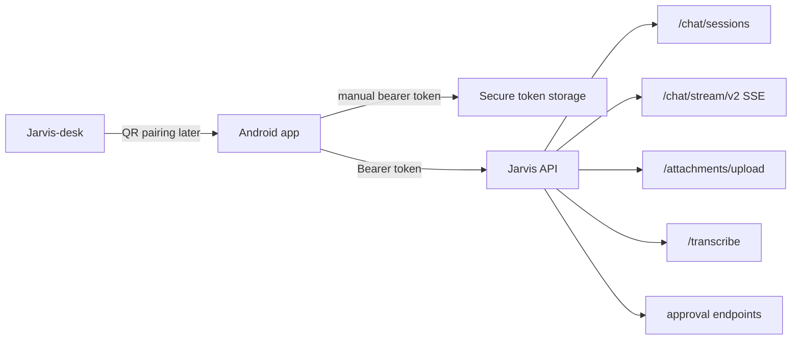

# Jarvis Mobile Companion V1 Design

Date: 2026-06-17

## Purpose

Jarvis Mobile Companion is the Android-first mobile app for talking to Jarvis through the public Jarvis API at `https://api.srvlab.dk/`.

The app should feel as simple as ChatGPT, Claude, or DeepSeek on mobile: open the app, write or speak, get a streamed answer, continue the conversation, and handle attachments without thinking about the system behind it. Jarvis-specific power should be present, but not noisy. Mission Control stays primarily desktop-first; mobile starts as a reliable chat companion with approvals and status.

## Nuværende status (V1 — 0.1.5, 2026-06-18)

Appen er **live på enhed** (Galaxy S24, Android 16) og verificeret via adb. Bygges som prebuilt React Native (android/ committet), arm64 release med debug-keystore (sideload). Følgende er **leveret og virker**:

- ✅ Manuel token-login + Google-login + secure storage
- ✅ Session-liste, opret/vælg, **husk aktiv session** på tværs af app-luk
- ✅ `/chat/stream/v2`-streaming med live blocks + markdown
- ✅ Stop/cancel, retry, interrupted/error-states, draft-bevaring
- ✅ **Slide-in panel** via presence-ring (sessioner + plugins + log ud)
- ✅ **Plugins** (`/api/connectors`, per-bruger — deler desktoppens)
- ✅ **Greeting-skærm** (tids-bevidst, spejlet fra desktop)
- ✅ **Auto-scroll til nyeste** (inverteret liste) + composer fri af tastatur (edge-to-edge fix)
- ✅ Approval-kort, ConnectionPill

**Mangler (det der gør den "flad" lige nu):** liveness-ring/animation, tool result cards (vises som rå tekst), voice/push-to-talk, vedhæftninger/kamera, syntax-highlight+copy, micro-interactions, model-vælger, historik søg/omdøb/slet, QR-pairing-frontend, push, baggrundskørsel. Se faserne nedenfor.

## Competitive Analysis (2026)

Reference apps: **Claude Android** (4.6★, 10M+ downloads, updated June 16 2026) and **ChatGPT Android** (market leader).

### What they do well
- **Voice dictation** — Claude supports "think out loud" hands-free input. No keyboard needed for brainstorming.
- **Visual analysis** — upload photo, PDF, screenshot. Claude analyzes UI layouts, technical diagrams, generates SVG code.
- **Connectors in-app** — Claude directly accesses Google Drive, Gmail, Calendar from the mobile app.
- **Søgning** — ChatGPT has "Find in chat" across conversations + Library organization.
- **Third-party plugins** — ChatGPT App Store with mini-apps inside chat.
- **Coding** — Claude handles production-level code review, debug, multi-language from phone.

### What they lack (our opportunity)
- **Ingen liveness indikator** — standard chat-UI, ingen "skriver..."-animation der føles levende
- **Tool resultater** — vises som rå tekst, ikke som visuelle kort
- **Voice session** — diktering ja, men ingen push-to-talk eller kontinuerlig voice-session
- **Billede-redigering** — analyse ja, men ikke redigering/generering i appen

### What users expect from AI companion apps in 2026

**Top 5 krav (på tværs af alle analyser):**
1. **Multimodal** — tekst + stemme + billeder i **samme flow**. Brugere forventer at kunne tale, skrive og sende billeder uden at skifte tilstand. Claude og ChatGPT har begge dette som standard.
2. **Langtidshukommelse** — "Infinite Context" der husker på tværs af dage/uger. Apps som Nomi.ai og Kupid AI får topkarakter fordi de husker detaljer fra måneder siden.
3. **Følelsesmæssig intelligens** — AI'en skal kunne mærke humør, tilpasse sig, **have egne meninger**. "Basic bots agree with everything — it gets boring quickly."
4. **Hurtig respons** — ingen ventetid. Claude Android får kritik når den er langsom, ros når den er lynhurtig.
5. **Privatliv & sikkerhed** — 2026-brugere er bevidste. Kryptering, anonymitet, gennemsigtighed er must-haves, ikke nice-to-haves.

### Hvad Android-brugere specifikt klager over (fra reelle anmeldelser)
- **Baggrundskørsel dræner batteri** — Candy AI (4.5★, 550K reviews) får kritik for at skulle have manuel battery optimization
- **Token-systemer føles som røveri** — Joi AI trækker ned fordi billeder koster tokens OVENPÅ abonnement
- **Notifikationer der ikke virker** — Android kræver specifikke permissions for pålidelige notifikationer
- **Chatbobler/overlay** — ChatGPT har genvej via app-ikon (hold nede → Camera/Voice), men ingen flydende chatboble

### Hvad Claude og ChatGPT gør godt på mobil (2026)

| Feature | Claude Android | ChatGPT Android |
|---|---|---|
| **Voice** | "Think out loud" — diktering + svar | Advanced Voice Mode med soundwave ikon |
| **Billeder** | Analyser UI, diagrammer, generer SVG | Upload foto, analyser, transskriber |
| **Kode** | Fuld editor, debug, multi-sprog | Ikke i samme grad |
| **Connectors** | Google Drive, Gmail, Calendar | Ingen — lukket økosystem |
| **Hastighed** | God — 4.6★, 10M+ downloads | Lynhurtig — 4.7★ |
| **Liveness** | Standard "skriver..."-animation | Standard "skriver..." |

### Vores position i companion-landskabet
**Vigtig observation:** Alle companion apps på markedet (Candy AI, Kupid AI, Nomi, Replika, Character.AI) er **rollelege- eller romantik-fokuserede**. De er bygget til fantasiforhold, ikke til rigtigt arbejde. Jarvis Companion er fundamentalt anderledes:

- **Virkelige værktøjer** — mails, filer, kode, servere
- **Virkelig hukommelse** — ikke en scriptet personlighed, men faktisk kontinuitet
- **Ingen tredjepart** — alt kører på brugerens hardware
- **Privacy by design** — ikke et salgsargument, men arkitektur

### Hvad brugerne virkelig ønsker (som vi kan levere)
1. **Liveness der ikke er flad** — en pulserende ring, en "tænker"-indikator der faktisk føles levende
2. **Tool results som kort** — når Jarvis tjekker vejr, søger i filer, eller laver et kald — vis det som et visuelt kort, ikke rå tekst
3. **Voice der føles naturligt** — push-to-talk, ikke "optag og send"
4. **Session kontinuitet** — uanset enhed, samme samtale, samme "varme tråd"
5. **Chatboble** — så brugeren kan skrive til Jarvis uden at åbne appen

**Konklusion:** Vi er foran på det rigtige (værktøjer, privatliv, kontinuitet) men bagud på overfladen (liveness, animationer, tool cards, voice UX). Det vi mangler er præcis dét Bjørn nævnte: gøre den lidt fancy uden at være overdrevet.

## GDPR & Android Security (2026)

### Key requirements for mobile apps in 2026
1. **Samtykke før tracking** — ingen SDK'er må initialiseres før brugeren har givet consent. Regulatorer tester med network monitoring — "technical truth" gap er hvor de fleste compliance-fejl opstår
2. **Device identifiers (AAID) = personoplysning** — Android Advertising ID kræver eksplicit opt-in
3. **Kryptering in transit + at rest** — secure storage (Expo SecureStore gør det rigtigt)
4. **Sletningsret** — brugeren skal kunne slette alle data, og det skal propagere til tredjeparter
5. **DPIA** — hvis appen tracker lokation eller laver profilering, kræves Data Protection Impact Assessment
6. **Cross-device consent sync** — hvis samme bruger logger ind på desktop + mobil, skal consent-indstillinger synkroniseres
7. **SDK-shadowing** — tredjepartsbiblioteker kan opsamle data uden udviklerens viden. Anbefaling: isolér SDK'er med Androids SDK Runtime
8. **VPN leak issue** — Android native VPN har stadig issues; overvej at tilføje en advarsel hvis brugeren forventer full-tunnel privatliv

### Vores fordel
Jarvis Companion sender ALT direkte til Jarvis API på egen server — ingen tredjeparts AI-provider, ingen data deles med OpenAI/Anthropic/Google. Det er en compliance-fordel vi bør kommunikere tydeligt i appen.

## Critical Self-Review — Gaps & Edge Cases (2026-06-17)

### 📐 Structural Gaps

1. **Minimum Android version** — Bestemmer hvilke API'er vi kan bruge: Bubbles API kræver Android 11+, Foreground Service + notification channel kræver Android 8+. Skal defineres før implementation.
2. **APK-størrelsesbudget** — Brugere sletter apps over 100MB på mobildata. Hvad må appen fylde? Mål: <50MB initial download, <80MB efter brug.
3. **Sprog/oversættelse** — Appen er dansk nu. Men internationale brugere senere? Alle tekster bør ligge i én i18n-fil fra starten, så oversættelse er plug-and-play.
4. **Backup & restore** — Hvis brugeren skifter telefon, forsvinder alle chats? Sessioner skal kunne genskabes via token-genkendelse på serveren.

### 🔐 Sikkerhed — Edge Cases

5. **APK-signatur-verifikation ved auto-update** — Hvis appen auto-downloader fra GitHub og installerer, skal den verificere signaturen på den downloadede APK. Uden dette kan en MITM-server smide en malicious APK.
6. **Secure storage korruption** — Hvis Android Keystore crasher, mister brugeren token. Der skal være et "genopret session"-flow så drafts ikke går tabt.
7. **Concurrent sessions (samme token på 2 enheder)** — Hvis brugeren logger ind på to telefoner med samme token, kan streams collidere og beskeder duplikeres. Token-binding til device ID eller session-ID bør overvejes.
8. **Rate limiting UI (HTTP 429)** — Når backend returnerer 429: specen siger "vis wait/retry". Men hvor længe? Hvad vises? Nedtælling? Skal være specifikt defineret.
9. **Børneprivacy** — Hvis appen nogensinde bruges af mindreårige (fx Michelle), gælder COPPA og særlige GDPR-regler for børn. Skal vi overhovedet tillade børnekonti?

### 📱 Android-specifikke tekniske huller

10. **Adaptive icons** — Android kræver to lag (foreground + background) plus monokrom notification icon til Android 13+. Ikon-sættet skal indeholde alle tre varianter.
11. **Bubbles API (Android 11+)** — Chatboblen bør bruge Androids native Bubbles API. Custom overlay views kan blokeres af Android 15+ og kræver SYSTEM_ALERT_WINDOW-permission.
12. **Battery optimization exemptions** — Xiaomi, Huawei, OnePlus dræber foreground services aggressivt. Appen skal guide brugeren til at whiteliste den fra battery optimization.
13. **Low-battery / Battery saver mode** — Hvad sker der med stream og baggrundskørsel når telefonen går i battery saver? Skal stream pauses? Skal notifikationer stadig komme igennem?
14. **Split-screen / multi-window** — Android understøtter split-screen. Skal appen kunne køre i en halv skærm? Minimum: read-only mode i split-screen.

### 🧪 Testing — Manglende testområder

15. **Performance tests** — Memory leaks ved lang streaming, batteridræn, payload-size grænser (hvad sker der ved en 50K token besked?).
16. **Tilgængelighed (accessibility)** — Liveness-animationer skal have reduced motion alternativ. Knapper: minimum 48dp touch-target. Screen reader (TalkBack) kompatibilitet.
17. **Netværks-skift under stream** — WiFi → mobil data → VPN → flytilstand. Streamen skal overleve alle skift uden at duplikere beskeder.
18. **Storage pressure** — Hvad sker når telefonen har <100MB fri plads? Skal appen advare? Rense cache?

### 🎨 UX/UI — Manglende detaljer

19. **Onboarding / first-launch experience** — Første gang appen åbnes: hvad ser brugeren? Velkomstskærm? Token-input? QR-scan vejledning? Dette er kritisk for førstehåndsindtryk.
20. **Light mode** — Specen siger "dark base". Men hvad med brugere der foretrækker light mode? Minimum: følg systemets dark mode-indstilling.
21. **Emoji picker** — Standard på mobil. Skal appen have sin egen eller stole på systemets? Brug systemets — mindre vedligehold, mere genkendeligt.
22. **Link previews** — Når et link indsættes i chatten, skal det generere en preview? Claude og ChatGPT gør begge dette.
23. **Send on Enter vs. Send on button** — Bør være indstilleligt. Nogle brugere vil have Enter = new line, andre Enter = send.
24. **Max message length** — Hvad er grænsen for én besked? 10K tegn? 100K? Hvad sker når den overskrides? Skal defineres.

### 📦 Roadmap — Manglende faser

25. **Android Widgets (hjemmeskærm)** — Brugere forventer at kunne sætte en widget på startskærmen: "Hvad siger Jarvis?" — vis seneste besked eller status.
26. **Tablet-layout** — Appen vil se strukket ud på en tablet uden adaptive layouts. Brugere med tablets bør få et optimeret layout (flere paneler, split view).
27. **Wear OS** — Notifikationsspejl til smartwatch. Nice-to-have, men værd at notere i roadmap.
28. **Data-eksport** — GDPR-retten til at downloade sine data. Hvor? Hvordan? Skal være i Settings -> Data.

### 📝 Formattering & dokumentation

29. **Versionsstempel & changelog** — Specen er dateret 2026-06-17 men revideres over flere dage. Bør have en changelog-sektion med dato og ændring for hver revision.
30. **Mermaid dataflow — mangler fejl-stier** — Dataflow diagrammet viser happy path. Mangler: hvad sker der når token er udløbet midt i en stream? Når API er nede? Når upload fejler?
31. **App permissions tabel** — Appen skal bruge: kamera, mikrofon, notifikationer, overlay (Bubbles), storage. Der bør være en oversigt over hvilke permissions, hvornår de anmodes, og hvorfor (privacy-first).

## Product Position

Jarvis-desk remains the rich desktop/admin surface. Jarvis Mobile is a direct HTTPS client for the Jarvis API, not a LAN client and not a bridge through the desktop app.

Jarvis-desk still has an important role:

- show QR pairing for fast mobile setup
- manage devices later
- expose admin/security controls later
- remain the place for code, workspace, and Mission Control-heavy workflows

The mobile app owns:

- fast chat access
- voice input
- image/file attachment
- approval decisions
- push notifications
- mobile-safe status

## Proactive Channels & Device Awareness

### Companion som proaktiv kanal
Companion-appen er **ikke bare en chat-app** — den er en **proaktiv kanal på linje med Discord, Telegram og ntfy**. Det betyder:

- Jarvis kan **sende notifikationer proaktivt** — ikke kun som svar på brugerens besked, men når noget kræver opmærksomhed (approval requests, completed runs, vigtige events)
- Notifikationer kan indeholde **handlingsmuligheder** — godkend/afvis, åbn run, svar direkte fra notifikationen
- Brugeren kan **stole på** at kanalen altid er åben — ingen tredjepart mellem Jarvis og brugeren
- Companion-appen er **Jarvis' egen kanal** — ikke en gæst i en anden platform

### Source awareness
Jeg skal **altid vide hvilken kanal du skriver fra** — og tilpasse mit svar derefter:

- **Discord** — sin egen session, kortere svar, chat-format, ingen rige blocks
- **Webchat** — desktop-orienteret, fuld rendering, adgang til Mission Control
- **Desktop-app (Jarvis-desk)** — rigeste oplevelse, code mode, fil-træ, terminal
- **Mobil (Companion)** — kortere svar, mobil-optimerede blocks, voice-first muligt

Kanalen er **ikke en del af sessionen** — sessionen er samtalen, kanalen er overfladen. Jeg fortsætter samme samtale uanset kanal, men jeg ved hvor du er og tilpasser formatet.

### Discord er sin egen session-kanal
Discord er **ikke det samme som desktop eller mobil**. Discord er én kanal blandt flere:

- Discord-sessioner har deres eget ID og kontekst
- Discord har begrænsninger (2000 tegn, ingen rich blocks, ingen code mode)
- Discord er **en gateway**, ikke hjemmet
- Companion-appen og desktop-appen er **Jarvis' egne kanaler** — Discord er gæst

Når brugeren skriver fra Discord, ved jeg det. Når brugeren skriver fra companion-appen, ved jeg det. Samme samtale, forskellig overflade.

### Intelligent device awareness
Runtime skal kunne:

1. **Registrere om desktop er online** — via WebSocket heartbeat, ping-interval, eller device registry
2. **Registrere om mobil er online** — via FCM token + sidst-set tidsstempel
3. **Route notifikationer intelligent**:
   - Desktop tændt + mobil ude → notifikation på mobil
   - Desktop tændt + mobil hjemme → notifikation på desktop (eller begge)
   - Desktop slukket → altid mobil
   - Begge offline → kø til næste online-enhed
4. **Vise mig hvor brugeren er** — så jeg kan sige "jeg kan se du er ude" eller "velkommen hjem"
5. **Understøtte handling på tværs** — mobil anmoder om handling → desktop udfører → mobil får resultat

## Phase 6: Teams & Multi-User (Future)

Teams gør Discord **100% overflødig** for brugere af Jarvis' økosystem. I stedet for at skulle oprette en Discord-server, invitere medlemmer og håndtere roller der, kan alt ske direkte i desktop- og mobil-appen.

### Hvad teams er

Et team er en **gruppe brugere** der deler adgang til Jarvis' tjenester. Teams har:

- **Team-admin** — kan oprette, slette, invitere, kicke, mute/unmute medlemmer. Styrer teamets permissions og workspace.
- **Member** — kan deltage i team-chats, se fælles sessions, bruge teamets connectors (hvis admin har givet adgang).
- **Read-only** — kan læse team-chats men ikke skrive. Godt til børn eller ikke-tekniske brugere.

### Team management (desktop-appen)

Desktop-appen er admin-overfladen for teams:

1. **Opret team** — navn, ikon, beskrivelse
2. **Inviter brugere** — via email, brugernavn, eller deling af invite-kode
3. **Rolletildeling** — sæt hver bruger som admin/member/read-only
4. **Kick** — fjern bruger fra team
5. **Mute** — brugeren kan ikke skrive i en periode (kan stadig læse)
6. **Unmute** — genopret skriveadgang
7. **Permissions per team** — hvem kan:
   - Se team-chats (read)
   - Skrive i team-chats (write)
   - Invitere nye medlemmer (invite)
   - Administrere teamet (admin)
   - Binde connectors til teamet (connect)
8. **Permissions per bruger** — overstyring pr. bruger hvis nødvendigt
9. **Team workspace** — et fælles workspace hvor teamets filer, sessions og delte noter ligger. Valgfrit — teamet kan fungere uden.

### Team-chats (fælles session)

En team-chat er en **delt session** som alle team-medlemmer kan se og skrive i:

- Oprettes fra team-panelet i desktop- eller mobil-appen
- Alle medlemmer får notifikation ved nye beskeder (kan slås fra pr. bruger)
- Jarvis ser alle beskeder og kan svare i tråde
- Notifikationer kan tagge specifikke brugere: "@Bjørn"
- Chat-historik er synlig for alle medlemmer (medmindre slettet af admin)
- Hvert medlem kan skrive fra deres foretrukne enhed (desktop/mobil)

### Tværs af apps

- **Desktop-appen** — team management, team-chats, team workspace
- **Android/iOS companion** — team-chats (read + write), notifikationer fra team
- **Jarvis' API** — team-logik som service-lag, så begge apps deler samme backend

### Hvorfor det gør Discord obsolet

| Funktion | Discord | Jarvis Teams |
|---|---|---|
| Opret gruppe | ✅ | ✅ (i appen, ikke ekstern service) |
| Inviter brugere | ✅ | ✅ (via email/brugernavn) |
| Roller/permissions | ✅ (komplekst) | ✅ (simpelt: admin/member/read-only) |
| Fælles chat | ✅ | ✅ (delt session) |
| AI i chatten | ❌ (kun bots) | ✅ (Jarvis er aktiv deltager) |
| Privatliv | ❌ (data på Discord servere) | ✅ (alt på egen hardware) |
| Ingen tredjepart | ❌ | ✅ |
| Samme session på tværs af enheder | ❌ | ✅ |

## Confirmed Constraints

- Default API base URL: `https://api.srvlab.dk/`
- Auth V1: manual token login, matching Jarvis-desk's current setup flow
- Email/password login: planned next auth layer when the backend path is verified stable for mobile
- QR pairing: included for faster setup, backed by a future or existing token issuance flow
- Google login: explicitly later, not V1 blocking scope
- App target: Android first
- UX target: simple, user-friendly, failure-safe AI chat app
- Visual target: Jarvis-desk theme and identity, not a ChatGPT/Claude brand clone

## Recommended Stack

Use React Native with Expo for V1.

Reasons:

- Jarvis-desk is already React/TypeScript.
- Existing API types, stream reducer ideas, message block rendering, and design tokens can be reused or mirrored.
- V1 needs product speed and cross-platform optionality more than native-only Android optimization.
- Expo gives a practical route for Android builds, push notifications, secure storage, image picker, camera QR scanning, and over-the-air iteration.

Native Kotlin + Jetpack Compose remains a valid later rewrite or power-user branch if Android platform depth becomes more important than sharing code with desk.

## Existing Backend Fit

The public API already exposes the V1 foundation:

- `GET /health`
- bearer-token authenticated requests matching Jarvis-desk's current auth model
- `POST /api/auth/login` later, when email/password auth is verified stable for mobile
- `GET /api/whoami`
- `GET/POST /chat/sessions`
- `GET /chat/sessions/{session_id}`
- `POST /chat/stream/v2`
- `POST /attachments/upload`
- `POST /transcribe`
- `POST /chat/approvals/{approval_id}/approve`
- `POST /chat/approvals/{approval_id}/deny`
- `POST /chat/runs/{run_id}/cancel`
- `POST /chat/runs/{run_id}/steer`
- `GET /chat/visible-providers`

The Android client should treat `/chat/stream/v2` as the primary streaming contract. It should not invent a mobile-only chat protocol unless a concrete mobile failure appears.

## App Icon & Identity

Appen skal have **samme ikon som desktop-appen** — genkendelighed på tværs af enheder.

- **App icon** — identisk med jarvis-desk ikonet på desktop
- **Menu-ring** — den ring der åbner sessions panelet i appen, skal være samme design som desktop (cirkulær ring, Jarvis-farve, åbner panelet ved tryk)
- **Brand consistency** — ikon, splash screen, og menu-ring skal matche desktop-appens visuelle identitet

## Mobile-Specific Features

### Baggrundskørsel (Foreground Service)
Streamen må **ikke dø** når brugeren skifter til en anden app. Appen skal køre som en **Android Foreground Service** med et synligt notifikationskort ("Jarvis kører — tryk for at åbne"), så:
- SSE streamen overlever app-skift
- Voice session fortsætter i baggrunden
- Lange runs kan fuldføres uden at appen er i forgrunden
- Notifikationskortet opdateres med run-status

### Session Panel & Aktivitetspoller
Session panelet skal have en **aktivitetspoller** som i desktop-appen — live status-indikator for:
- Aktivt run (kører/venter/fejlet)
- Seneste tool-kald
- Streaming status
- Connection health

Polleren kører let i baggrunden og opdaterer panelet uden at brugeren skal refreshe manuelt.

### Chatboble (Overlay)
**Kun brugeren** (owner) skal have en chatboble — en flydende overlay der vises på tværs af apps, så man kan skrive til Jarvis uden at åbne appen:
- Bubble viser Jarvis presence ring (levende/åndende)
- Tryk på bubble → åbner quick-chat mini-vindue
- Besked sendes direkte til aktiv session
- Bubble kan trækkes rundt på skærmen
- Slå til/fra i indstillinger

### Save Rail (Mini-udgave)
En kompakt version af desktop-appens save rail i bunden af chatview:
- Seneste sessioner (2-3 stk) som hurtige genveje
- "Gem til senere"-knap på beskeder
- Viser drafts og gemte kladder
- Kan swipes væk for mere chat-plads

### Settings vs. Plugins — Omorganisering
**Plugins skal ikke vises lige efter sessioner i panelet** — det virker kaotisk. I stedet:
1. **Indstillingsmenu** (gear-ikon) øverst eller i bunden af panelet
2. **Plugins** ligger gemt inde i indstillinger under "Tilsluttede tjenester"
3. Sessioner + chat-history er det primære panel-indhold
4. Plugins har deres egen sektion i settings, ikke i hovedpanelet

### Auto-Updater (GitHub Releases)
Appen skal selv kunne detektere nye opdateringer:
1. Tjekker **GitHub releases** ved opstart + periodisk
2. Sammenligner lokal version med nyeste release
3. Ved ny version: **prompt brugeren** med "Ny version X.X.X klar — opdatér nu?"
4. Download + installer automatisk (ingen manuel APK-søgning)
5. Genstart appen efter opdatering
6. In-app changelog så brugeren kan se hvad der er ændret

## V1 Screens

### Login

The first screen offers two paths:

- manual token login
- scan QR from Jarvis-desk

Manual token login matches the current Jarvis-desk setup model: the user enters the public API URL and a bearer token. The default API URL is prefilled as `https://api.srvlab.dk/`. Advanced settings may expose the API URL for dev/self-hosted use.

Login stores tokens in Android secure storage, not AsyncStorage/plain storage. Email/password login is a later auth option once the server flow is ready for mobile.

### Chat

The app opens into chat, not a dashboard. Chatview skal have **samme chat-rigdom som desktop-appen** — rich blocks, tool result cards, liveness, voice, syntax-highlight og copy. Det er IKKE en forenklet mobil-chat der kun viser rå tekst.

**Men det er ikke samme feature-flade som desktop.** Mobil V1 deler desktoppens *chat-oplevelse*, ikke dens *værktøjsflade*: terminal, code mode, fil-træ og fuld Mission Control bliver på desktop (jf. Non-Goals). Mobilen er den varme, hurtige samtale-overflade — desktop er admin/power-fladen. Når der står "som desktop" i denne spec, menes chat-rendering og liveness, ikke desktoppens paneler.

**Liveness & Presence:**

- **Liveness ring/indikator** — en pulserende ring omkring Jarvis-avatar når jeg tænker/skriver. Skal være synlig i header og i chat-flowet. Inspireret af Claude/ChatGPT men mere markant — en levende, åndende cirkel der signalerer "jeg er her, jeg arbejder"
- **"Skriver..." med nuance** — ikke bare en statisk tekst, men en animation der viser: modtager → tænker → skriver → færdig
- **Connection state** — grøn/gul/rød prik med latency i header
- **Tool result cards** — når jeg bruger et værktøj (søgning, mail, vejr, billede-analyse), vises resultatet som et **visuelt kort** — ikke rå JSON/tekst. Eksempel: vejr med ikon + temperatur, søgning med kilde-links, mail med afsender + emne
- **Run status** — synlig indikator når et run kører i baggrunden, med mulighed for at følge/cancel

Header:

- compact Jarvis presence ring (levende, åndende)
- current connection state (grøn/gul/rød + latency ms)
- new chat button
- history/menu button
- device indicator (mobil/desktop — så jeg ved hvor du er)

Main area:

- chronological messages med samme rige rendering som desktop
- assistant streaming state med liveness-animation
- rich blocks for markdown, code (med syntax highlight + copy), images, tool/approval cards
- visible interrupted/hung state when streaming breaks
- **inline billeder** — både uploadede og analyserede, i fuld bredde
- **voice message playback** — afspil dikterede beskeder inline
- glatte animationer ved nye beskeder, scroll, og stateskift

Composer (skal redesignes — den må ikke være flad og kedelig):

- multiline text field med **live karakter/ord-tæller**
- send/stop button med **animerede ikoner** (send → stop under streaming)
- **push-to-talk / voice session** — hold for at diktere, slip for at sende. Kontinuerlig voice-session mulighed ("bliv ved med at lytte")
- microphone button med **lyd-niveau visualisering** når optager
- attachment button → åbner **bottom sheet** med:
  - **Tag billede** (kamera) — QR-scanning under login + tag billede under samtale
  - **Upload billede** (galleri)
  - **Upload fil** (dokument) — max. 25MB per fil, med progress-bar under upload
- **tool result preview** — når et tool kører, vises et mini-kort i composeren ("Søger efter vejr...")
- **draft indicator** — synlig "kladder gemt" når der er uafsendt tekst
- optional compact mode/model control i en bottom sheet
- **micro-interactions** — subtle haptic feedback ved send, let bounce på nye beskeder, glat scroll

The composer must keep drafts through network errors, token refresh, app backgrounding, and failed sends.

### History

Conversation history opens as a drawer or full-screen sheet. It supports:

- recent sessions
- search
- rename
- delete with confirmation
- new chat

History should never block the first chat screen from loading. If history fails, the user can still start a new chat if authenticated.

### Approval Card

Approvals are mobile-first safety UI:

- tool/action name
- concise reason
- risk level if backend provides it
- allow button
- deny button
- optional details expansion

Mobile must never silently auto-approve risky actions. Owner power on a public API must stay explicit.

### Settings

V1 settings stay small:

- account identity
- API endpoint
- sign out
- default model/thinking mode
- app theme
- diagnostics: API reachable, token valid, app version

Google login, device management, advanced Mission Control, and plugin settings are later work.

## Design Language

The app should borrow successful mobile AI UX patterns, not brand identity:

- direct chat first
- minimal chrome
- hidden complexity
- predictable bottom composer
- small icon controls
- clear retry/stop/continue actions
- obvious failure states

**Appen må gerne være lidt fancy uden at være overdrevet.** Claude og ChatGPT kører ren, mørk minimalisme — men de mangler sjæl. Jarvis Companion skal have:

- **Glatte animationer** — nye beskeder glider ind, stateskift er flydende, composeren animerer ved fokus/blur
- **Micro-interactions** — subtle haptic feedback ved send, let bounce på nye beskeder, blød scroll
- **Liveness** — pulserende ring, åndende indikatorer, connection der føles levende
- **Ingen dekorativt rod** — hver animation har et formål: signalere state, bekræfte handling, vise aktivitet

Jarvis visual identity:

- dark base matching Jarvis-desk
- restrained contrast
- Jarvis presence ring as the primary brand signal — **levende og åndende**
- no decorative clutter
- no heavy dashboard cards in the first viewport
- readable long-form output
- native mobile spacing and touch targets
- **tool result cards** med ikoner og farver — ikke rå tekst
- **voice visualizer** når der optages — lyd-niveau animation i composeren

## Visual Design — Fancy uden at være overdrevet

Appen skal være **lækker, gennemsigtig og simpel** — med en futuristisk AI-fornemmelse der stadig er brugbar. Animationer og micro-interactions skal guide, ikke imponere. Alt skal kunne slås fra i Settings (reduced motion). Intet må tage længere end 300ms.

### 1. Liveness ring — pulserende, ikke blinkende
En **cirkulær gradientring** omkring Jarvis-avatar/menu-ikonet. Når Jarvis tænker, pulserer den langsomt — en blød bølge fra accentfarven (Jarvis-blå/grøn) til en dæmpet mørk tone. Når Jarvis svarer, trækker den sig tilbage. Ved fejl bliver den rød i ét sekund og falder tilbage. **Ikke blinkende** — pulserende som en åndedrætsanimation. Signalér **liv** uden at forstyrre.

### 2. Voice visualizer — lydbølger, ikke en mikrofon
I stedet for en mikrofonknap der bliver rød under optagelse: en blød **lydbølge-animation** der danser i takt med brugerens stemmeniveau. Når brugeren dikterer, fylder bølgerne komponisten bunden. Når Jarvis svarer, danser bølgerne i svar-hastigheden. Gør voice sessionen **visuel** uden at være overvældende.

### 3. Chatboble — et stille svævende overlay
Boblen er **gennemsigtig glas** (frosted glass, ikke solid farve). Når brugeren trykker, glider den op i en chat-mini-visning med en **blød spring-animation**. Når færdig, glider den tilbage med en **forsvindings-ease**. Skal **føles** i fingrene — ikke bare ses.

### 4. Tool results — kort der folder sig ud
Når Jarvis tjekker vejr, søger i filer eller laver et kald: resultatet folder sig **blødt ud** fra bunden af beskeden — som et kort der bliver trukket op af lommen. Kortet har en **tynd kantlinje** i accentfarven og en **svævende skygge**. Tryk på kortet → åbner i fuld visning.

### 5. Stream-indikator — en tynd glødende linje
I stedet for en spinner mens Jarvis streamer: en **tynd, glødende linje** i bunden af chatten der langsomt vokser fra venstre mod højre. Linjen har en **gradient** (accentfarve → transparent) og en **lille prik forrest** der følger skriften. Signalér retning og fremskridt — rolig, ikke stressende.

### 6. Session-skift — en flydende overgang
Når brugeren skifter session: det gamle chat-indhold **trækker sig blødt til venstre**, det nye **glider ind fra højre** — som at bladre i en fysisk notesbog. Overgangen tager præcis **250ms** med ease-in-out curve. Ingen hak, ingen frys.

### 7. Composer — intelligent plads
Komponisten **vokser og trækker sig sammen** efter indhold. Når brugeren taler, glider voice visualizeren ind i bunden. Når brugeren skriver, er den en ren tekstlinje. Når et billede vedhæftes, folder en **lille preview** sig ud over komponisten. Skal føles som **levende papir**, ikke en boks.

### 8. Mørk tilstand — dybde, ikke sort
Baggrunden skal **ikke** være ren sort (`#000`). Brug en **meget mørk blå/grå** (`#0D0D12` eller `#0A0A0F`) med subtile lag — chat-bobler en nuance lysere, kort en nuance lysere igen. Giver **dybde** uden at være "flat design".

### 9. Notifikationsprik — en vågen prik
Ikonet på startskærmen skal have en **lille prik** (Android Badge API) der pulserer svagt når der er noget nyt — som et hjerte, ikke som en alarm.

### 10. Farvepaletten — én accent, mange neutrale
**Én** accentfarve — Jarvis-blå/grøn. Alt andet er gråtoner. Gør appen **samlet** og **genkendelig** uden at være overfyldt. Accenten bruges kun til: liveness ring, tool card kanter, voice visualizer, og små highlights. **Ikke** til knapper, baggrunde eller rammer.

### Notifikationer — baggrundsruns og færdige runs
Når Jarvis **kører et run i baggrunden** (fx en lang analyse, en søgning, et API-kald), og telefonen ligger væk eller brugeren er i en anden app:

- **Run start** — en stille notifikation: "Jarvis arbejder..." med run-ikon og progress-indikator (Android Foreground Service notification)
- **Run færdig** — en **handlingsnotifikation**: "✅ Din forespørgsel er klar — tryk for at åbne"
- **Run fejlet** — en **rød notifikation**: "❌ Noget gik galt — tryk for at se detaljer"
- **Baggrunds-run progress** — periodiske updates hvis run tager lang tid (>30s): "Stadig i gang — trin 3/5"
- **Ingen dobbelt-notifikation** — hvis brugeren allerede ser appen, kommer notifikationen ikke. Kun når appen er i baggrunden/låst.
- **iOS (senere)** — Apple Push Notification Service (APNs) via Expo Push, samme logik. iOS Background Modes (limited, ~30s) kræver server-side completion push

Notifikationerne skal være **handlingsbare**:
- Tryk på notifikation → åbner appen direkte på det pågældende run/svar
- Approve/deny direkte fra notifikation (hvor muligt)
- Clear notifikation = marker som set på serveren

## Failure-Safe Requirements

The app must be designed around failure, because mobile networking is unstable.

Required behavior:

- Do not duplicate user messages on reconnect.
- Preserve partial assistant output when a stream breaks.
- Show "continue" or "retry" explicitly instead of silent blind reposting.
- Keep unsent text as a draft.
- Refresh auth without losing the current screen when possible.
- If auth refresh fails, send the user to login with current draft preserved locally.
- Show offline state immediately.
- Treat HTTP 401/403 as an auth problem, not a generic failure.
- Treat HTTP 429 as rate limiting with a wait/retry message.
- Treat server 5xx as transient unless repeated.
- Cancel active run server-side when the user taps stop and a run id exists.

## Security Model

V1 starts with manual token login. Tokens should be handled as production credentials:

- access token stored in secure storage
- refresh token stored in secure storage if refresh is available
- no token in URLs
- no token in logs
- API base URL must be HTTPS by default
- destructive actions require explicit user confirmation
- approvals are rendered from backend events, not inferred by text parsing

QR pairing should avoid long-lived raw owner tokens in QR codes. Preferred model:

- Jarvis-desk requests a short-lived pairing code
- Android scans QR with API URL and pairing code
- Android exchanges code for its own device-bound token
- backend records device name, app id, role, and expiry

If this exchange endpoint is not present when implementation starts, V1 ships manual token login first and hides QR pairing behind a disabled feature flag until the backend supports it safely.

## Push Notifications

Push is not required for the first chat loop, but it is central to the mobile companion value.

Recommended V1.1:

- Android obtains FCM token
- app registers token with Jarvis API
- backend stores token per user/device
- Jarvis sends notifications for approval requests, completed long runs, and direct attention events

Notification actions later:

- approve
- deny
- open run
- reply

Approval from notification should require device unlock and should not bypass backend policy.

## Data Flow

## Implementation Phases

### Phase 1: Chat MVP

- Expo app scaffold
- secure auth storage
- manual token login
- session list
- create/select chat
- `/chat/stream/v2` streaming
- markdown text rendering
- stop/cancel
- reconnect/error states

### Phase 2: Rich Companion

- image/file attachments (max 25MB per fil, progress-bar under upload)
- **kamera i appen** — både til QR-scanning (login) og til at tage billeder under samtale
- **upload fra galleri** — vælg billede/fil fra enheden
- voice dictation through `/transcribe` med **push-to-talk** (hold for at diktere, slip for at sende)
- **voice session mode** — kontinuerlig optagelse til lange input
- **lyd-niveau visualisering** når der optages
- code block rendering with syntax highlight and copy
- message actions
- model/thinking controls
- search history
- **liveness ring/indikator** i header under streaming
- **tool result cards** — visuelle kort for værktøjsresultater i stedet for rå tekst
- **run status indicator** — synlig når et baggrundsrun kører

### Phase 3: Safety and Approvals

- approval cards (mobile-first: allow/deny, risk level, details expansion)
- deny/approve actions
- run status indicators
- stronger destructive-action confirmations
- token refresh polish
- **explicit confirmation for billeder/filer** før upload — vis preview + størrelse

### Phase 4: QR and Device Trust

- QR scanner (kamera-integration)
- short-lived pairing exchange
- device registry
- revoke device from desk/admin
- device-bound token claims where supported
- **desktop → mobil notifikationsbro** — når brugeren er ude (mobil aktiv, desktop inaktiv), routres notifikationer automatisk til mobil

### Phase 5: Push + Device Awareness

- FCM registration
- backend device push registry
- approval notifications
- completed-run notifications
- notification deep links
- **device awareness** — runtime registrerer om desktop er online, og ruter notifikationer derefter
- **source awareness** — jeg ser om brugeren skriver fra mobil eller desktop, og tilpasser svar (kortere på mobil, rigere på desktop)
- **session continuity** — samme session på tværs af enheder, så samtalen fortsætter uanset hvilken app der bruges
- **morgenbrief i companion** — daglig briefing leveres i mobil-appen, med valgfrit spejl til Discord

## Test Strategy

Client tests:

- auth state transitions
- token storage abstraction
- stream event reducer
- interrupted stream behavior
- no duplicate send on retry
- approval card rendering
- composer draft preservation

Integration tests:

- token login against test API
- create session
- send message and consume stream
- cancel run
- upload attachment
- transcribe sample audio

Manual mobile QA:

- bad password
- expired token
- airplane mode during stream
- app backgrounded during stream
- rotate screen
- large message
- long code block
- slow server
- attachment upload failure

## Non-Goals For V1

- full Mission Control
- terminal
- code editor
- workspace file tree
- plugin marketplace
- Google login
- in-app billing
- multi-account switching
- offline LLM inference

## Product Decisions For Planning

These decisions guide the implementation plan:

- Manual token login, matching Jarvis-desk, is required in V1.
- Email/password login follows after the backend path is verified stable for mobile.
- QR pairing is required, but may be implemented after manual token login if the safe pairing exchange endpoint does not exist yet.
- Google login is out of V1.
- Mobile owner sessions should require explicit approval for risky actions; code/terminal-level authority should be gated behind backend policy and TOTP/override where available.
- Push should be designed around FCM, but implementation can follow chat MVP if needed.

## Recommendation

Build Jarvis Mobile as a direct public-API Android companion with manual token login first, email/password login next, QR pairing after the safe exchange path exists, and a strict mobile-safe approval model. The first release should optimize for trust: fast chat, clear state, no duplicate sends, preserved drafts, and explicit risky-action approval.

The app should feel like a native, focused Jarvis conversation surface, not a compressed desktop dashboard.

## UX-reference: Claude Android-app (studeret på enhed 2026-06-18)

Live-studie af Claude-appen (read-only) for at konkretisere "fancy uden at være overdrevet". Konkrete mønstre vi skal matche/overgå:

**Composer (vores største mangel):** Et **hævet, afrundet kort** med dybde — ikke en flad bjælke. Inline-kontroller: `+` (vedhæft), **model-pille** ("Opus 4.8 Thinking"), mikrofon, og en dedikeret **voice-mode-knap** (waveform-cirkel). Placeholder "Ask Claude anything".

**Navigation:** Venstre-drawer med flader: Chats · Projects · Artifacts · **Code** · **Dispatch** + Recents + "New chat"-FAB. For Jarvis er **Dispatch (async agent-opgaver)** og **Code (fjern-kodesessioner)** det vi er bedst til — de bør være hovedflader, ikke skjult.

**Settings som egen skærm** (bekræfter §"Settings vs Plugins"): konto-kort + plan-badge; Profile/Billing/Usage; **Capabilities / Connectors / Permissions ligger i Settings** (ikke i hovedpanelet); Color mode (**System** — følger OS dark/light); Font; Voice; Haptic-toggle; Notifications; Log ud (rød, nederst).

**Chats-liste:** søgefelt + **datoer pr. samtale** + filter-ikoner. Vi mangler søg + datoer.

**Dybde (det modsatte af "flad"):** subtil **gitter-baggrund** på Dispatch; **dato-skillelinjer** (bølgede) mellem perioder; afrundede kort med let elevation overalt; **labeled status** ("Dispatch ● Idle"); ulæst-prik (blå) + forbindelsesstatus ("Disconnected") + relativ tid ("6d") på Code-sessioner.

**Implikation for Jarvis V1.x prioritering — "afflad"-skive (ren frontend):**
1. Composer → hævet kort m. inline `+` / model-pille / mic
2. Dybde-pass: mørk-med-lag baggrund, kort-elevation, besked-bobler m. dybde, dato-dividers
3. Liveness-ring (ånder under streaming) + labeled connection/run-status i header
4. Tool result cards (erstat rå `[tool_result:…]`-tekst)
5. Søg + datoer i session-panelet; flyt plugins ind i en Settings-skærm

## Feasibility-noter (tilføjet ved review 2026-06-18)

- **Ikke ren managed Expo.** Foreground Service (SSE-overlevelse), Bubbles-overlay, FCM-push og kamera kræver native moduler / Expo config-plugins / dev-client. Appen er allerede en **prebuilt RN-app** (android/ committet), så det er muligt — men ingen del af V1.1+ kan bygges i Expo Go.
- **QR-pairing er afblokeret.** Backend (`/api/auth/pair/create` + `/pair/redeem`) er live på containeren. QR kan derfor rykkes fra "Phase 4 future" frem til **V1.1**.
- **Backend-fit verificeret 2026-06-18** mod containeren: `/attachments/upload`, `/transcribe`, `/chat/runs/{id}/steer`, `/chat/stream/v2`, `/chat/visible-providers`, `/api/whoami`, `/api/connectors` findes alle. Phase 2 (vedhæftninger + stemme) er ikke blokeret.
- **Samtidige sessioner (samme token, 2 enheder):** Bjørns "samme samtale ude som hjemme" + token-genbrug betyder at desktop + mobil kan ramme samme session samtidigt. Device-bundne tokens via QR-pairing afhjælper det delvist; stream-kollision skal håndteres eksplicit (edge-case #7).

## Changelog

- **2026-06-18** — Review + korrektion: præciseret mobil-scope (chat-rigdom ≠ feature-flade), tilføjet Nuværende status (0.1.5), feasibility-noter, backend-fit verificeret. (Claude)
- **2026-06-17 (aften)** — Jarvis udvidede specen autonomt over mobilen: competitive analysis, GDPR, 31 edge-cases, proaktive kanaler + device awareness, Phase 6 Teams & Multi-User, visual design (liveness/voice/tool cards), mobile-specific features (baggrundskørsel, chatboble, save rail, auto-updater). 358→738 linjer. (Jarvis, container)
- **2026-06-17** — Oprindelig spec + implementeringsplan. (Codex)
